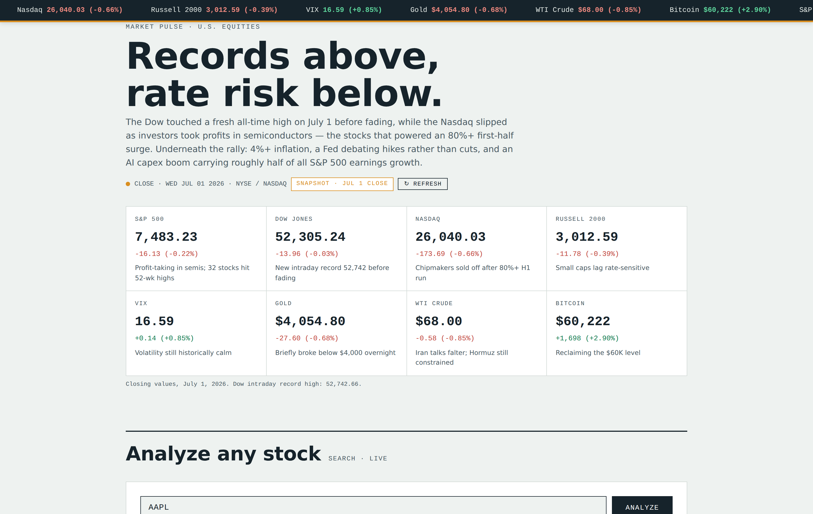
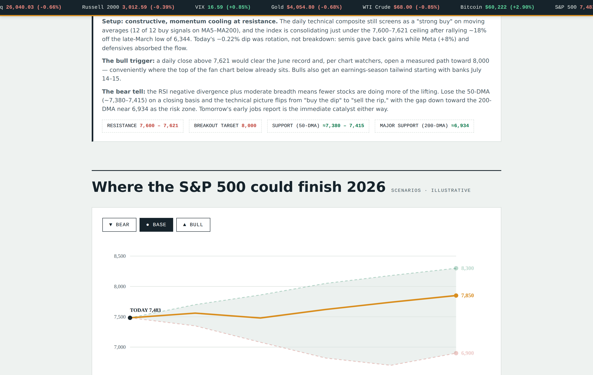

# Market Pulse

**Live demo:** https://market-analyzer-rpcg.onrender.com *(free tier — first load after idle takes ~30s to wake)*

A live U.S. market dashboard with post-market indicator analysis. Node/Express backend relays Yahoo Finance data server-side and renders bear/base/bull scenario projections as an interactive SVG fan chart.



## How it works

- **Server-side data relay** — the Express backend fetches market data and serves it via `/api/quotes` and `/api/history`, so there are no CORS proxies and no API keys exposed in page source
- **Response caching** — quotes cached 60s, history 10min, with a capped in-memory cache so arbitrary symbol lookups can't grow memory unbounded
- **Graceful degradation** — live prices via Finnhub when a key is present; falls back to delayed Yahoo closes (with a DELAYED badge) when it isn't, and to a dated snapshot with auto-retry if the upstream doesn't answer
- **Zero-dependency frontend** — single-file dashboard, SVG charts drawn directly, no framework



## Stack

Node 18+ · Express (only dependency) · Yahoo Finance chart API · optional Finnhub for real-time quotes · deployed on Render

## Run locally

```bash
npm install
npm start        # http://localhost:3000
```

Optional live quotes: `FINNHUB_API_KEY=xxxx npm start`

## Deployment

Deployed as a Render Web Service (`render.yaml` included): build `npm install`, start `npm start`, free instance. Set `FINNHUB_API_KEY` in the Render dashboard environment — never in the repo. Note the free plan spins down after ~15 min idle; first visit afterward takes 30–60s.
